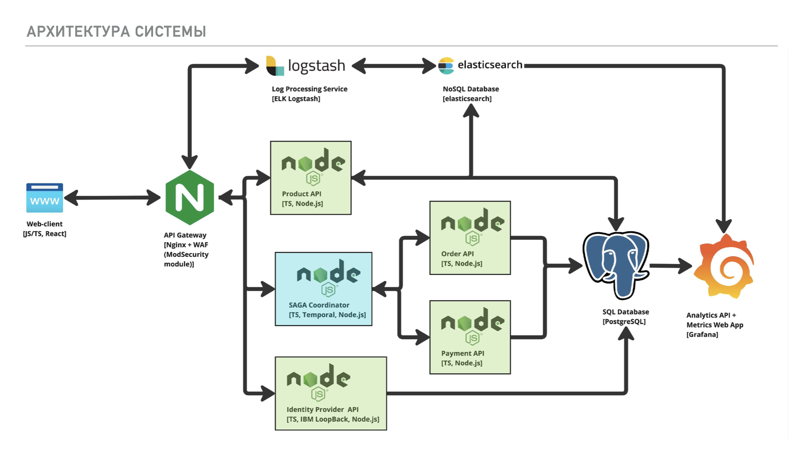
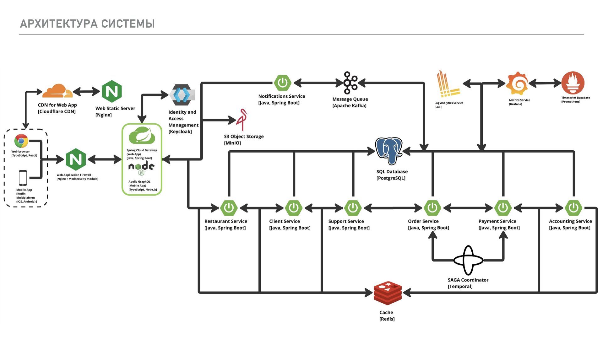

# Java Boys @ ARCHI.Tech 2024

🏆 **Победители в номинации "Архитектор системы" на хакатоне ARCHI.Tech 2024 от ВТБ**

## 🧑‍💻 Команда

**Java Boys**
- Рустам Курамшин — системная архитектура
- Александр Янчий — API и работа с данными
- Рустам Гулямов — модель данных
- Рустам Зулкарниев — бизнес-процессы
- Владислав Калинин — инфраструктура

---

## 💡 О хакатоне

[ARCHI.Tech](https://architechhack.vtb.ru/) — это хакатон от ВТБ, посвящённый проектированию архитектуры современных IT-систем. Наша команда принимала участие в двух кейсах:

1. **Задача для разогрева**: проектирование web-сервера интернет-магазина с системой аналитики.
2. **Основная задача**: проектирование микросервисной системы приёма заказов для ресторанной сети.

---

## 🧩 Задача №1 — Web-сервер интернет-магазина

Проектировали архитектуру интернет-магазина с аналитикой пользовательского поведения.

### 🧱 Основные компоненты
- **Product API** — управление товарами
- **Order API** — корзина, оформление заказов
- **Payment API** — интеграция с платёжными системами
- **Identity Provider API** — регистрация, вход, управление пользователями
- **Analytics API и Metrics Web App** — сбор логов и визуализация дашбордов
- **SAGA Coordinator** — координация распределённых транзакций

### 📄 Презентации решений
[Презентация: Web-сервер и аналитика](./docs/Java-Boys-Задача-WEB-сервер.pdf)

### 📈 Архитектура

---

## 🍽️ Задача №2 — Система приёма заказов для сети ресторанов

Проектировали высоконагруженную систему с ролевой моделью, масштабируемой архитектурой и бизнес-логикой.

### 🧾 Требования
- До 100 ресторанов, 40 000 заказов в день
- Роли: гость, официант, администратор ресторана, бухгалтер, администратор системы
- Клиенты: веб и мобильные приложения

### 🔧 Компоненты
- **Order, Payment, Accounting, Restaurant, Client, Support Services**
- **IAM на Keycloak + API Gateway (REST/GraphQL)**
- **SAGA на Temporal, Kafka, Redis, PostgreSQL**
- **CDN, WAF, Metrics (Prometheus, Grafana)**

### 📄 Презентации решений
[Презентация: Система приёма заказов](./docs/Java-Boys-Задача-Система-приема-заказов.pdf)

### 📊 Архитектура

---

## 📦 Развёртывание

- Высокодоступный кластер Kubernetes
- PostgreSQL в кластере с репликацией и резервным копированием
- Redis с master/slave и персистентностью
- Kafka + MinIO
- API Gateway с разграничением ролей по JWT
- Логирование через Loki, алертинг через Prometheus/Grafana

---

## 🔒 Особенности

- **IAM с Keycloak**: роли и скопы в JWT
- **SAGA-паттерн** через Temporal
- **Kafka для уведомлений**
- **CDN и WAF для ускорения и защиты фронта**

---

## 🏁 Результат

Проект стал победителем в номинации **"Архитектор системы"** благодаря продуманной архитектуре, масштабируемости и учёту реальных бизнес-требований.

---

## 📂 Материалы

В папке `docs/` находятся PDF-презентации обоих решений.
